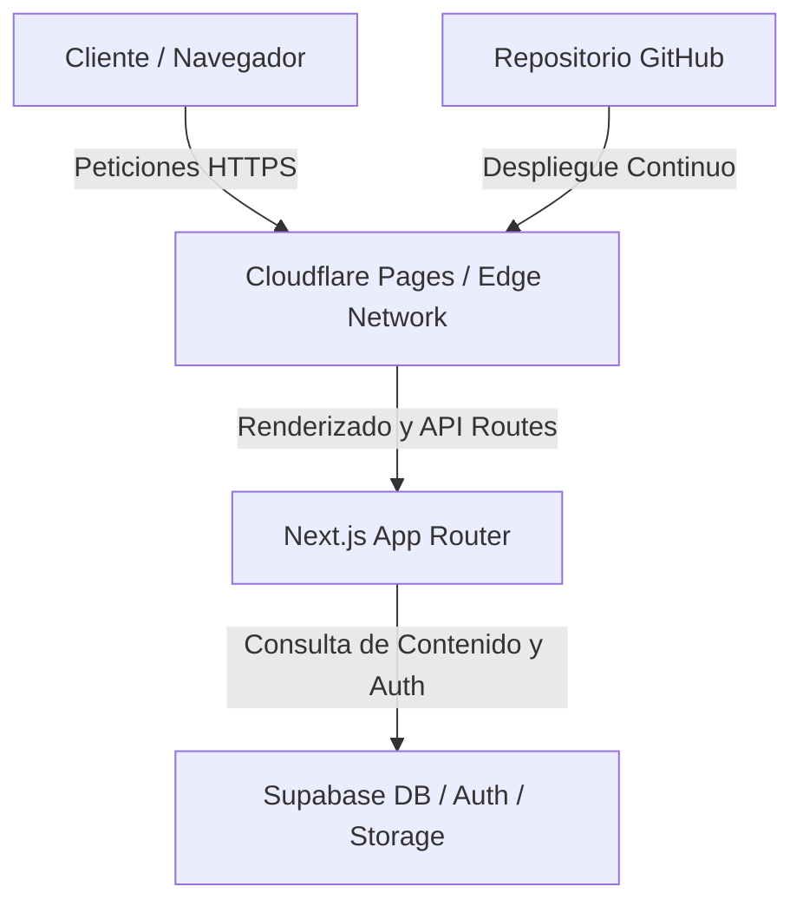

# Especificación de Diseño: Reconstrucción de iCenit.ai

Este documento detalla el plan de diseño técnico para la reconstrucción del sitio web **iCenit.ai** utilizando código propio y libre de licencias de constructores de páginas comerciales como Elementor.

## 1. Arquitectura de la Aplicación

Implementaremos una arquitectura Jamstack moderna con capacidades dinámicas integradas:

### 1.1 Stack Tecnológico
*   **Frontend**: Next.js 14+ (React) utilizando el App Router.
*   **Estilos**: Vanilla CSS con CSS Modules y Variables CSS Globales para asegurar una estética premium, carga rápida y excelente rendimiento SEO (Core Web Vitals).
*   **Base de Datos**: Supabase PostgreSQL (para producción) y SQLite (para desarrollo local).
*   **ORM**: Drizzle ORM (para consultas y migraciones tipadas de base de datos) lo que permite un cambio inmediato entre SQLite y PostgreSQL cambiando solo la cadena de conexión.
*   **Autenticación**: Supabase Auth (para producción) y sesión de cookies local basada en contraseñas cifradas (para desarrollo local).
*   **Almacenamiento**: Supabase Storage para currículums (sección Carreras) e imágenes dinámicas.

---

## 2. Modelo de Datos (Base de Datos)

El contenido dinámico y los formularios del sitio se estructuran en las siguientes tablas de base de datos:

### 2.1 Tablas de Gestión de Contenido
1.  **`site_settings`**: Configuración general del sitio (teléfono, email, dirección, redes sociales, SEO meta tags).
2.  **`modules`**: Los 10 módulos del sistema (Hallazgos, Riesgo Dinámico, etc.) con campos para título, subtítulo, meta descripción, y contenido detallado.
3.  **`module_features`**: Valores destacados de cada módulo (relación uno a muchos con `modules`).
4.  **`use_cases`**: Los 3 casos de estudio detallados (Investigación de Accidente, Análisis Multivariable, Gestión 1-3-10).
5.  **`business_initiatives`**: Las 4 iniciativas de negocio principales (Data Management, Tool Consolidation, Data Privacy, Artificial Intelligence) con sus respectivos iconos.
6.  **`team_members`**: Miembros del equipo de la empresa.

### 2.2 Tablas de Captura de leads (Formularios)
1.  **`contact_submissions`**: Mensajes recibidos en la página de Contacto.
2.  **`demo_requests`**: Solicitudes recibidas en la página de Solicitar Demo.
3.  **`job_applications`**: Postulaciones a vacantes (sección Carreras), incluyendo enlaces a sus currículums almacenados en Storage.

---

## 3. Panel de Administración (`/admin`)

El panel de administración se diseñará con estética oscura, minimalista y profesional.

### 3.1 Vistas y Funcionalidades
*   **`/admin/login`**: Acceso seguro.
*   **`/admin/dashboard`**: Métricas de visitas del sitio y resumen de nuevos formularios recibidos.
*   **`/admin/content`**: Lista de páginas del sitio para edición en tiempo real de textos principales.
*   **`/admin/modules`**: Editor de los 10 módulos de James Cloud Platform y sus valores destacados.
*   **`/admin/use-cases`**: Editor de casos de uso prácticos.
*   **`/admin/leads`**: Tablas interactivas para ver y exportar solicitudes de demo, mensajes de contacto y aplicaciones de empleo (descarga de PDFs de CV).

---

## 4. Migración de Local a Producción

Para permitir el desarrollo inmediato en local mientras se configuran las cuentas de producción:

| Recurso | Entorno Local | Entorno de Producción | Método de Cambio |
|---|---|---|---|
| **Base de datos** | SQLite (`local.db`) | Supabase PostgreSQL | Variable de entorno `DATABASE_URL` |
| **Autenticación** | Credenciales hardcoded en `.env` | Supabase Auth (OAuth / Email) | Middleware de Next.js selectivo |
| **Almacenamiento** | Carpeta local (`public/uploads`) | Buckets de Supabase Storage | Proveedor de almacenamiento abstracto en código |

---

## 5. Diseño Estético y de Experiencia de Usuario (UX)

Para lograr un acabado premium ("Wow factor"):
*   **Colores**: Paleta oscura basada en HSL (Slate oscuro, acentos en azul eléctrico de alta tecnología y verde esmeralda para éxitos/confirmaciones).
*   **Tipografía**: Google Fonts (Inter para lectura general, Outfit o Clash Display para títulos).
*   **Componentes Premium**:
    *   Efecto **Glassmorphism** en el menú de navegación superior y tarjetas (tarjetas semitransparentes con `backdrop-filter: blur()`).
    *   Micro-animaciones de hover en botones, enlaces y tarjetas.
    *   Carrusel adaptado y acordeones CSS fluidos para la sección de preguntas frecuentes ("¿Por qué James?").

---

## 6. Plan de Verificación

### Pruebas Locales
*   Verificar que todas las páginas públicas del PDF carguen correctamente sin errores de consola.
*   Probar el envío de formularios y verificar que los registros se guarden en SQLite.
*   Acceder al panel `/admin` local, modificar un texto y confirmar que se actualice en la web pública.

### Pruebas de Producción (Supabase + Cloudflare)
*   Conectar el repositorio a Cloudflare Pages y verificar que compile sin advertencias.
*   Probar el inicio de sesión con Supabase Auth.
*   Verificar la subida de archivos adjuntos (PDFs) en el formulario de carreras a Supabase Storage.
